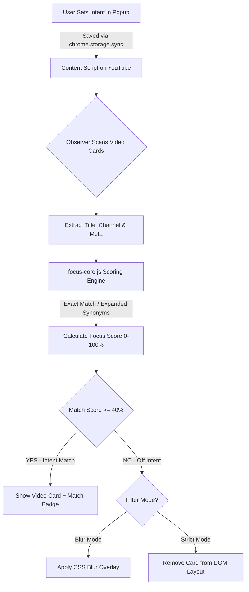

<div align="center">

# 🧩 Focus AI Pro

### Reclaim Your YouTube Attention with Intent-Based AI Distraction Filtering


<p align="center">
  <b>Focus AI Pro</b> is a powerful, local-first Chrome extension that helps you break free from YouTube algorithm traps. Define your study or working intent, and watch off-topic clickbait, distracting recommendations, and endless shorts blur or vanish instantly.
</p>

[Key Features](#-key-features) • [Installation Guide](#-step-by-step-installation-guide) • [How It Works](#-how-it-works) • [Analytics Dashboard](#-watchtime-analytics-dashboard) • [Landing Page Website](#-showcase-landing-page-website) • [Privacy](#-100-local-privacy-guarantee)

</div>

---

## 🌟 Key Features

- 🎯 **Intent-Based Keyword Filtering**: Define session topic keywords (e.g. `learn react`, `python dsa`, `system design`). Videos are dynamically scored against your intent.
- 🌫️ **Filter Modes (Blur vs. Strict Hide)**:
  - **Blur Mode**: Softly blurs off-intent videos on YouTube homepage & sidebar feeds, allowing hover-to-inspect.
  - **Strict (Hide) Mode**: Completely removes non-matching recommendation cards from the page DOM layout for deep focus.
- 📊 **Watchtime Analytics Dashboard**: Built-in interactive dashboard tracking your focused vs. distracted watchtime ratio, total intent minutes, and top learned topics.
- 🔒 **100% On-Device Privacy**: No remote servers, no user tracking, no backend database. All configuration & logs stay stored in `chrome.storage.local`.
- ⚡ **Zero-Latency Execution**: Lightweight content script scoring with zero overhead on video playback.

---

## 🛠️ Step-by-Step Installation Guide

Installing **Focus AI Pro** in Chrome, Brave, Microsoft Edge, or Arc takes under 60 seconds:

### Step 1: Download / Clone the Repository
Download the project ZIP or clone the repository to your computer:
```bash
git clone https://github.com/Soham167-prog/FocusAI-Pro.git
```
*(If downloaded as a ZIP file, extract/unzip the folder onto your disk).*

### Step 2: Open Chrome Extensions Page
1. Open Google Chrome.
2. In the top-right corner, click the **3 vertical dots icon (⋮)**.
3. Click or hover over **Extensions** and select **Manage Extensions**.  
   *(Or navigate directly to `chrome://extensions` in your address bar).*

### Step 3: Enable Developer Mode
Look at the **top right corner** of the Extensions page and turn **ON** the **Developer mode** toggle switch.

### Step 4: Load Unpacked Extension
1. Look at the **top left corner** where 3 buttons appear: `Load unpacked`, `Pack extension`, and `Update`.
2. Click **Load unpacked**.
3. Select the `Focus AI Pro` root directory containing `manifest.json`.

### Step 5: Pin Extension to Toolbar
1. Click the **Puzzle piece icon (🧩)** on the top right toolbar near your Google Account profile avatar.
2. Locate **Focus AI Pro** and click the **Pin icon** (📌).

### Step 6: Set Intent & Enable Focus Mode
1. Go to [YouTube.com](https://www.youtube.com).
2. Click the Focus AI Pro extension icon in your toolbar.
3. Enter your study keywords in the **Intent (keywords)** box (e.g. `learn js` or `dsa python`).
4. Click **Save** / **Enable Focus Mode**.

### Step 7: Configure Filter Mode & View Dashboard
- Toggle between **Filter Mode: Blur** and **Filter Mode: Strict (Hide)** in the popup.
- Click **Open Dashboard** to review your focus watchtime analytics!

---

## 🧠 How It Works

Focus AI Pro operates directly within the browser using a high-performance content script and shared scoring engine (`focus-core.js`):



### Core Components:
- **`manifest.json`**: Manifest V3 extension configuration, permissions (`storage`, `activeTab`, `scripting`, `tabs`).
- **`focus-core.js`**: Core NLP scoring logic, category classifier (`Learning`, `Entertainment`, `News`), and phrase matchers.
- **`content.js`**: Mutation observer engine monitoring YouTube DOM updates, injecting score badges, applying blur/hide filters, and recording local watchtime.
- **`popup.html` & `popup.js`**: Clean dark-mode extension popup controller for intent input, filter toggles, and dashboard navigation.
- **`dashboard.html` & `dashboard.js`**: Internal analytics dashboard tab built with Chart.js for data visualization.

---

## 📈 Watchtime Analytics Dashboard

Clicking **Open Dashboard** in the popup opens `dashboard.html`. It displays:
- **Focus Score Gauge**: Real-time percentage of time spent on intent-matched content.
- **Session Watchtime Logs**: Minutes spent studying vs. off-topic browsing attempts.
- **Top Watched Keywords**: Category breakdown of your most frequent intent topics.

---

## 💻 Showcase Landing Page Website

This repository includes a showcase website built with **React**, **JavaScript**, and **Tailwind CSS** featuring a live interactive YouTube simulator and 1-click ZIP package download.

### Running the Website Locally:
```bash
# Navigate to the website directory
cd website

# Install dependencies
npm install

# Start development server
npm run dev
```
Open `http://localhost:5173` to explore the website!

---

## 🛡️ 100% Local Privacy Guarantee

- 🔒 **Zero Remote Servers**: Focus AI Pro has no external backend, telemetry, or tracking scripts.
- 💾 **Local Storage Only**: All intent strings and watchtime metrics are kept inside your browser's `chrome.storage.local`.
- 👐 **Open Source**: You can audit every line of JavaScript code directly in this repository.

---

## 📄 License

Distributed under the **MIT License**. See `LICENSE` for details.

---

<div align="center">
  <sub>Built with precision to reclaim your YouTube focus.</sub>
</div>
